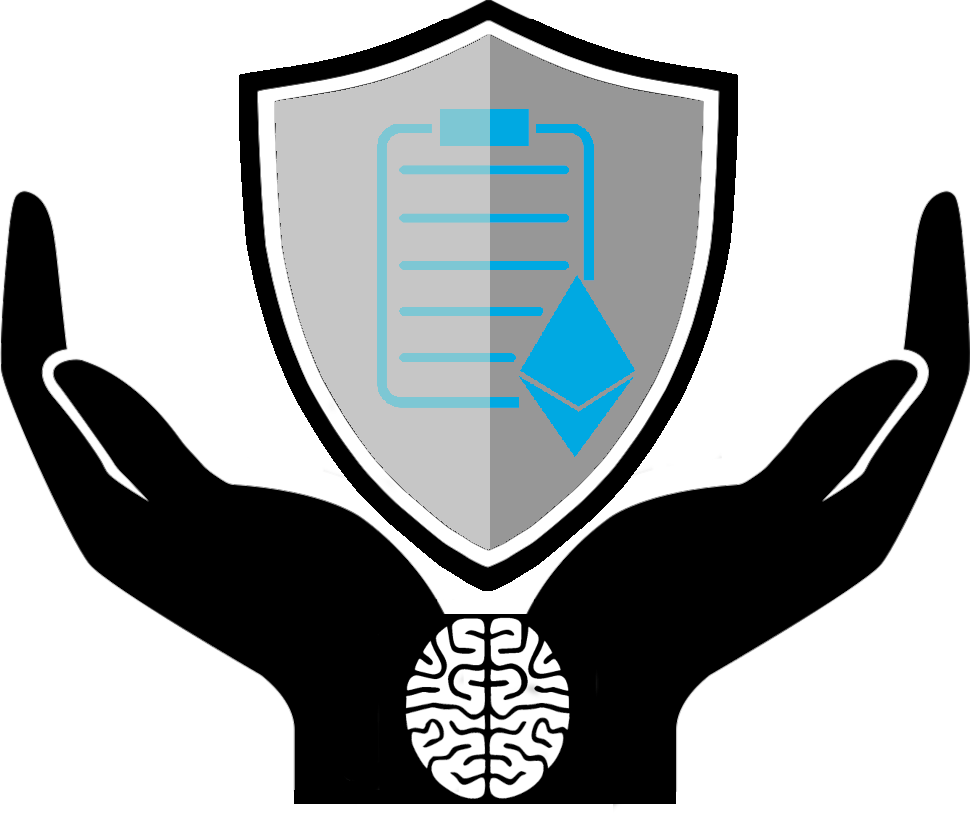

<!-- ## Why should we care about Smart Contract Vulnerability? -->
<!--[title](url "Hover title")-->
{: .center}
{:width="600px"}

## What are Smart Contracts?

Smart Contracts are computer programs that execute on a blockchain. The nature of blockchains allows us to run Smart Contracts in a trustless and decentralized environment, where the underlying cryptocurrency is the security for the involved parties. While different projects implement the concept of Smart Contracts, we concentrate on Ethereum as the most popular, adopted, and advanced implementation. 

At first glance, those Smart Contracts seem rather abstract. However, they provide the underlying technology in a vast and fast-growing ecosystem of NFTs, decentralized applications, and -- of course -- CryptoKitties. All of those systems have an invested interest of million and even billion dollars. Ethereum itself has a market cap of over 330 billion USD. Furthermore, all of those systems use the fundamental promise of trustless execution, where no 3rd parties are needed to establish trust between two strangers on the internet.

Generally, Smart Contracts are written in a scripting language and compiled into so-called bytecode. Then, the bytecode is included in the Ethereum blockchain via a transaction and executed by the miners (or soon validators via staking). Once the bytecode is on the blockchain, everybody can see the Smart Contract's bytecode and even issue transactions to execute functionalities of them.

### Why should we care about Smart Contract vulnerabilities?

As mentioned in the section above, the inherently public nature of deployed Smart Contracts and the possible financial incentives make Smart Contracts perfect targets for malicious actors. Historically, attackers were successful with their attacks and could steal millions, for example, exploiting the DAO contract. Not only that, but vulnerabilities in Smart Contracts are in contrast to a trustless environment. For example, the other party could plant vulnerabilities in Smart Contracts to exploit them later and invalidate the "code is law" principle of Ethereum.

### Why use ML and Transfer Learning?

To detect vulnerabilities in Smart Contracts, researchers and developers proposed many detection tools. Most of those tools apply static and dynamic code analysis in addition to fuzzing. While the security community widely adopted those tools, most of them have a substantial execution time of several minutes to hours. Even worse, specific tools only allow testing for a subset of potential security issues, which leads to a need to run and test Smart Contracts with multiple different tools. As a result, Smart Contract developers and users would need to deploy, understand and manage several security tools to test for most vulnerability classes.

In recent years classification and labeling of pictures, text, and also malware using Machine Learning arose. As such, the labeling of vulnerabilities in Smart Contracts using Machine Learning is the next logical step towards a more secure ecosystem. Furthermore, Machine Learning allows us to speed up the detection processes and combine different tools into one classification process. ML models enable developers and users to test Smart Contract bytecode near-instant without deploying a complex detection arsenal.

In classical Machine Learning, the training process is bound to a pre-defined set of labels and classes. So, once trained, a Machine Learning model can only detect an unchanging set of vulnerabilities. To alleviate this restriction, one can apply so-called Transfer Learning. Once a model was trained, we can reuse it to modify its labels (i.e., outputs) or even inputs without retraining the entire model. Transfer Learning, therefore, cuts back at training time and allows us to add new vulnerability classes seamlessly.

## Our Work towards Security of Smart Contracts

In our work, we demonstrate the effectiveness of Transfer Learning in the domain of Smart Contract vulnerabilities. Furthermore, we show that Transfer Learning is an exceptional tool to facilitate cross-domain application and allow in-domain extensibility. Specifically, we propose to use Transfer Learning to express the extensibility of our Machine Learning model in regards to vulnerability classes.

### ESCORT [LCFSDSK21]

We developed a practical tool-chain to apply Transfer Learning based on vulnerability classes on Smart Contracts in this work. We first introduce ContractScraper, where Smart Contract bytecodes are extracted from the blockchain using different tools. Then, the bytecode of 1.156.611 Smart Contracts is classified by three detection tools, allowing us to label Smart Contracts with eight unique vulnerability classes. Then, we introduce ESCORT -- our classification system. First, we train our model with six different classes and use Transfer Learning to extend our model to two additional classes. Here, we achieved substantially lower inference time of 0.02s, improved training time, and a mean F1-score of 95%. ESCORT can then be used to classify bytecode in an on-the-fly manner.

## Publications
 * [LCFSDSK21] **_ESCORT: Ethereum Smart COntRacTs Vulnerability Detection using Deep Neural Network and Transfer Learning_** by Oliver Lutz (University of Würzburg), Huili Chen ([University of California, San-Diego](https://sites.google.com/eng.ucsd.edu/huilichen/home)), Hossein Fereidooni ([TU Darmstadt](https://www.informatik.tu-darmstadt.de/systemsecurity/people_sys/people_details_sys_48576.en.jsp)), Christoph Sendner ([University of Würzburg](https://se.informatik.uni-wuerzburg.de/secure-software-systems-group/staff0/christoph-sendner/)), Alexandra Dmitrienko ([University of Würzburg](https://se.informatik.uni-wuerzburg.de/secure-software-systems-group/staff0/alexandra-dmitrienko/)), Ahmad Reza Sadeghi ([TU Darmstadt](https://www.informatik.tu-darmstadt.de/systemsecurity/people_sys/people_details_sys_45184.en.jsp)), and Farinaz Koushanfar ([University of California, San Diego](https://farinaz.eng.ucsd.edu/home)). Paper available as **[pre-print](https://arxiv.org/pdf/2103.12607.pdf)**.
